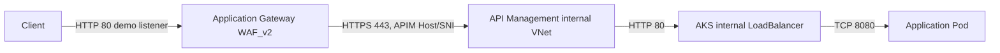

# Azure Landing Zone with AKS

This repository implements a modular Azure landing zone with conditional AKS,
Application Gateway WAF_v2, internal-mode Azure API Management, Azure Key Vault
integration, an example application, in-cluster monitoring, and DevSecOps
validation.

Terraform configuration is declarative and does not deploy resources until an
operator runs an apply operation.

## Architecture

```text
Internet
  -> Application Gateway WAF_v2
  -> internal API Management gateway
  -> internal AKS LoadBalancer Service
  -> application pods

application pods
  -> Microsoft Entra Workload Identity
  -> Key Vault Secrets Store CSI provider
  -> Azure Key Vault

application /metrics
  -> ServiceMonitor
  -> Prometheus
  -> Grafana
```

The original demo routed APIM to the Application Gateway public IP and used
AGIC to route the gateway to AKS. That path is superseded. APIM now requires
both AKS and the edge stack: the application has a separate internal
LoadBalancer backend, APIM is injected into its dedicated subnet, and
Application Gateway is the only public application entry point.



## Repository Layout

| Path | Purpose |
|---|---|
| `terraform/` | Reusable infrastructure modules and the root composition. |
| `app/` | Python application, Dockerfile, OpenAPI contract, and Kubernetes manifests. |
| `monitoring/` | Prometheus, Grafana, ServiceMonitor, and dashboard configuration. |
| `docs/` | Detailed edge, APIM, and network-security design documents. |
| `pipelines/` | GitHub Actions workflow reference. |
| `.github/workflows/` | Validation, image publication, and manual Terraform workflows. |

## Terraform Modules

| Module | Purpose | Primary resources |
|---|---|---|
| `00-foundation` | Naming, tags, and resource-group structure. | Resource groups |
| `01-networking` | Virtual network, subnets, NSGs, and data-driven NSG rules. | VNet, subnets, NSGs |
| `02-security-baseline` | Resource-group RBAC, management locks, and optional Key Vault. | Role assignments, locks, Key Vault |
| `03-edge` | Conditional public WAF frontend for internal APIM. | Public IP, WAF policy, Application Gateway |
| `04-workloads` | Conditional AKS, workload identity, Key Vault access, and internal backend contract. | AKS, managed identity, federated credential, role assignment |
| `05-apim` | Internal VNet API gateway, private DNS, and OpenAPI publication. | APIM service, private DNS, API, API policy |
| `root` | Composes modules and connects their inputs and outputs. | Environment-level orchestration |

The root module is the supported entry point. Child modules contain their own
provider constraints but receive environment configuration from root.

## Configuration

The root directory uses two local variable profiles:

| File | Purpose | Loading behavior |
|---|---|---|
| `terraform.tfvars` | Normal deployment profile with Key Vault, AKS, edge, and APIM enabled. | Loaded automatically by Terraform. |
| `terraform.safe.tfvars` | Minimal profile with optional deployment features disabled. | Loaded only when passed with `-var-file`. |

Both files contain environment-specific Azure identifiers and are ignored by
Git. `terraform.tfvars.example` remains the version-controlled template for
creating profiles in another environment.

Core inputs:

| Input | Default | Description |
|---|---|---|
| `subscription_id` | Required | Azure subscription used by the provider. |
| `tenant_id` | Required | Microsoft Entra tenant for Key Vault and identity resources. |
| `location` | `francecentral` | Deployment region. |
| `project_name` | `alz` | Short resource-name component. |
| `environment` | `dev` | Environment name: `dev`, `test`, or `prod`. |
| `owner` | `cyrine` | Tag value and suffix for globally unique Key Vault and APIM names. |
| `aks_internal_load_balancer_ip` | `10.10.2.10` | Static AKS-subnet address shared by the Kubernetes Service and APIM backend configuration. |
| `vnet_address_space` | `10.10.0.0/16` | Landing-zone VNet CIDR. |
| `subnets` | See example file | Logical subnet definitions. |

Conditional features:

| Input | Default | Effect when enabled |
|---|---|---|
| `enable_key_vault` | `false` | Creates the landing-zone Key Vault. |
| `enable_aks_demo` | `false` | Creates AKS and the application workload identity. |
| `enable_edge_stack` | `false` | Creates the Application Gateway WAF_v2 public frontend. |
| `enable_apim` | `false` | Creates internal Developer-tier APIM; requires the edge stack and AKS. |
| `enable_management_access` | `false` | Adds the internal management-to-AKS administration rule. |
| `enable_resource_group_locks` | `false` | Adds CanNotDelete locks to the network and security resource groups. |
| `enable_key_vault_purge_protection` | `false` | Enables irreversible Key Vault purge protection. |
| `key_vault_public_network_access_enabled` | `true` | Keeps Key Vault reachable until private networking is implemented. |

Additional inputs configure NSG rules, RBAC assignments, management locks, WAF
mode, APIM SKU, and AKS node sizing. See
[`terraform/root/variables.tf`](terraform/root/variables.tf) and
[`terraform/root/terraform.tfvars.example`](terraform/root/terraform.tfvars.example).

## Terraform Outputs

The root module exposes aggregate objects for:

- `foundation`: resource groups, location, naming prefix, and common tags;
- `networking`: VNet, subnets, NSGs, and NSG rules;
- `security_baseline`: RBAC assignments, locks, and optional Key Vault;
- `edge`: Application Gateway, public IP, and WAF policy when enabled;
- `workloads`: AKS, workload identity, Key Vault role assignment, and the
  internal application backend URL when enabled;
- `apim`: APIM service, private IPs, internal gateway hostname, API, and AKS
  backend when enabled.

Conditional outputs return `null` when their corresponding feature is disabled.

## Local Terraform Workflow

Initialize and validate from the repository root:

```powershell
terraform -chdir=terraform/root init
terraform fmt -check -recursive
terraform -chdir=terraform/root validate
```

Create and review the normal deployment plan. Terraform automatically loads
`terraform/root/terraform.tfvars`:

```powershell
terraform -chdir=terraform/root plan -out=tfplan
```

Apply the reviewed normal deployment plan:

```powershell
terraform -chdir=terraform/root apply tfplan
```

Create a safe/minimal plan by selecting the alternate profile explicitly:

```powershell
terraform -chdir=terraform/root plan -var-file=terraform.safe.tfvars
```

Destroy a safe/minimal deployment only when that profile was used to create the
current state:

```powershell
terraform -chdir=terraform/root destroy -var-file=terraform.safe.tfvars
```

Destroy the normal deployment with the automatically loaded normal profile:

```powershell
terraform -chdir=terraform/root destroy
```

Terraform state may contain infrastructure identifiers. Store state in an
approved backend and do not commit local state or variable files.

## Application Deployment

After Terraform has created the required AKS, identity, Key Vault, and edge
resources:

1. Confirm that `aks_internal_load_balancer_ip` is unused in the AKS subnet and
   matches the Service annotation under `app/k8s`.
2. Replace the managed-identity client ID and tenant ID markers locally, and
   verify the Key Vault name. Do not commit the populated manifests.
3. Add the required secret value directly to Key Vault.
4. Replace the application image's `latest` tag with an immutable GHCR SHA tag.
5. Render and review the Kustomize output.
6. Apply the manifests and verify the internal LoadBalancer address and
   Deployment rollout before testing APIM and Application Gateway.

See [`app/k8s/README.md`](app/k8s/README.md) for exact dependencies and commands.

## Security Controls

- Data-driven NSG rules with explicit ports, priorities, subnet keys, and Azure
  service tags.
- Application Gateway WAF_v2 with Microsoft Default Rule Set 2.2 as the public
  frontend for internal API Management.
- Microsoft Entra Workload Identity without stored Azure credentials in pods.
- Key Vault RBAC with a scoped `Key Vault Secrets User` assignment.
- Secrets Store CSI mounting without Kubernetes Secret synchronization.
- Non-root containers, dropped Linux capabilities, read-only root filesystem,
  seccomp, resource limits, and health probes.
- Internal-mode APIM with exact-hostname private DNS, rate limiting, and
  correlation-ID propagation.
- CI security gates for Terraform, Kubernetes, monitoring, and container images.

Detailed networking and ownership boundaries are documented in:

- [`docs/security.md`](docs/security.md)
- [`docs/network-security.md`](docs/network-security.md)
- [`docs/edge.md`](docs/edge.md)
- [`docs/apim.md`](docs/apim.md)

## CI/CD

| Workflow | Purpose |
|---|---|
| `validate.yml` | Terraform, source, image, Kubernetes, monitoring, and security validation. |
| `build-image.yml` | Publishes SHA-tagged application images to GHCR. |
| `demo-deploy.yml` | Runs an operator-selected Terraform plan, apply, or destroy action. |

The validation workflow does not authenticate to Azure or contact a Kubernetes
cluster. See [`pipelines/README.md`](pipelines/README.md) for triggers, inputs,
permissions, security gates, and required secrets.

## Monitoring

The monitoring assets install Prometheus and Grafana inside AKS and keep both
Services internal. See [`monitoring/README.md`](monitoring/README.md) for
installation, verification, access, persistence, and removal procedures.
